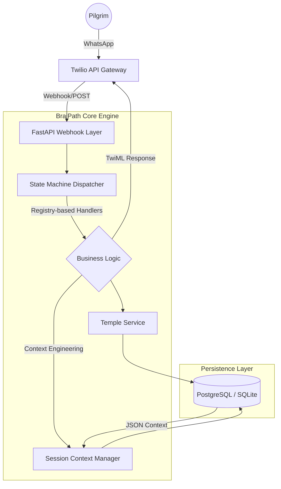
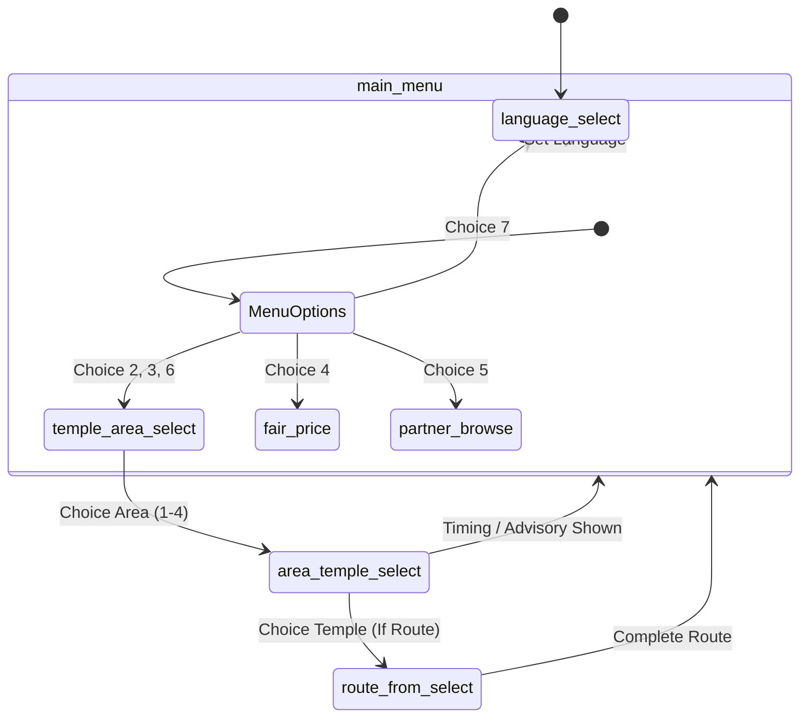

# 🕉️ BrajPath: Intelligent Pilgrimage Infrastructure

[](https://fastapi.tiangolo.com/)
[](https://www.sqlalchemy.org/)
[](https://www.twilio.com/)
[](https://www.python.org/)

**BrajPath** is a high-availability, multilingual WhatsApp AI assistant engineered to modernize the pilgrimage experience in the Mathura-Vrindavan (Braj) region. By combining **System Design** best practices with **Context Engineering**, BrajPath provides 24/7 automated guidance to millions of devotees.

---

## 🚀 Executive Summary (For CEOs & Founders)

### The Problem
Religious tourism in India is a multi-billion dollar industry, yet pilgrims face massive information asymmetry: shifting temple timings, predatory local transport pricing, and language barriers.

### The BrajPath Solution
A lightweight, "WhatsApp-first" infrastructure that delivers verified, real-time data through an intuitive conversational interface. 
- **Scalability**: Built on FastAPI to handle high-concurrency during peak festival seasons.
- **Localization**: Native support for **English, Hindi, Bengali, and Tamil**.
- **User Retention**: Context-aware engine that remembers pilgrim history to provide personalized travel suggestions.

---

## 🛠️ Technical Architecture (For CTOs & Tech Experts)

### 1. System Infrastructure


### 2. Registry-Based State Machine
Unlike traditional nested `if-else` bots, BrajPath utilizes a **Registry-based Handler Pattern**. This decouples conversation logic from the core engine, allowing developers to register new states/features using decorators (`@register_handler`).

### 3. Context Engineering Layer
The system implements a sophisticated **Session Context Manager** that tracks:
- **Interaction History**: Last 10 user intents for behavioral analysis.
- **Geospatial Memory**: Remembers last visited temples and areas to offer predictive navigation tips.
- **Persistence**: Structured JSON storage in PostgreSQL/SQLite for long-term user profile building.

### 4. Conversation Flow Logic


### 3. Enterprise-Grade Webhook Security
- **Twilio Signature Validation**: Prevents spoofing attacks in production.
- **Idempotent Seeding**: Ensures consistent environment setup across Dev/Staging/Prod.
- **Telemetry & Logging**: Detailed `query_logs` for business intelligence and bottleneck identification.

---

## 📂 Project Structure

```text
braj_sahayak/
├── app/
│   ├── api/            # Webhook & API endpoints (FastAPI)
│   ├── services/       # Core Logic: State Machine & Context Engine
│   ├── db/             # Persistence Layer: SQLAlchemy Models & Seed Data
│   └── data/           # Localization: Multi-language JSON schemas
├── migrations/         # Production-ready SQL schema migrations
├── docs/               # Enterprise Deployment & API Guides
└── tests/              # Automated Bot-Flow Validation
```

---

## ⚡ Quick Start & Deployment

### Environment Configuration
1. **Clone & Install**:
   ```bash
   uv sync  # Recommended: use 'uv' for 10x faster dependency resolution
   ```

2. **Initialize Infrastructure**:
   ```bash
   uv run python -m scripts.run_seed  # Idempotent database seeding
   ```

3. **Launch Production Server**:
   ```bash
   uv run uvicorn app.main:app --host 0.0.0.0 --port 8000
   ```

---

## 📈 Roadmap & Strategic Vision

- [ ] **AI-Powered NLU**: Transitioning from menu-driven to hybrid NLP for free-form queries.
- [ ] **Partner Ecosystem**: Verified "Local Service" marketplace integration (Hotels, Guides, verified E-Rickshaws).
- [ ] **Analytics Dashboard**: Real-time heatmaps of pilgrim movement based on `query_logs`.
- [ ] **Live Operational Notices**: Push notifications for sudden temple closures or crowd alerts.

---

## 🤝 Contribution & Contact

BrajPath is built for impact. We welcome technical experts, local authorities, and strategic partners to help us scale this spiritual infrastructure.

- **Developer Docs**: [docs/meta-cloud-api-migration.md](docs/meta-cloud-api-migration.md)
- **Deployment**: [docs/twilio-production-deployment.md](docs/twilio-production-deployment.md)

---
*Disclaimer: Data provided is for operational guidance. Verify live timings during peak festivals.*
